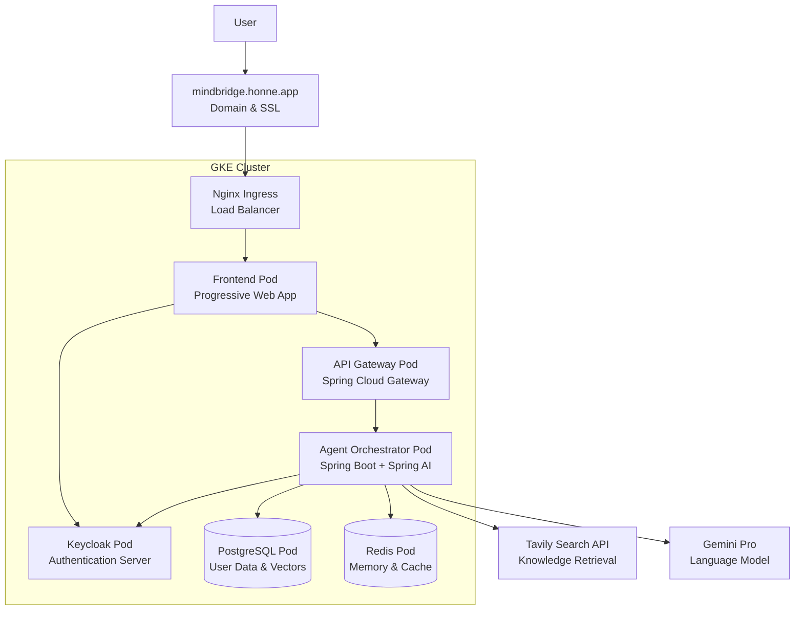
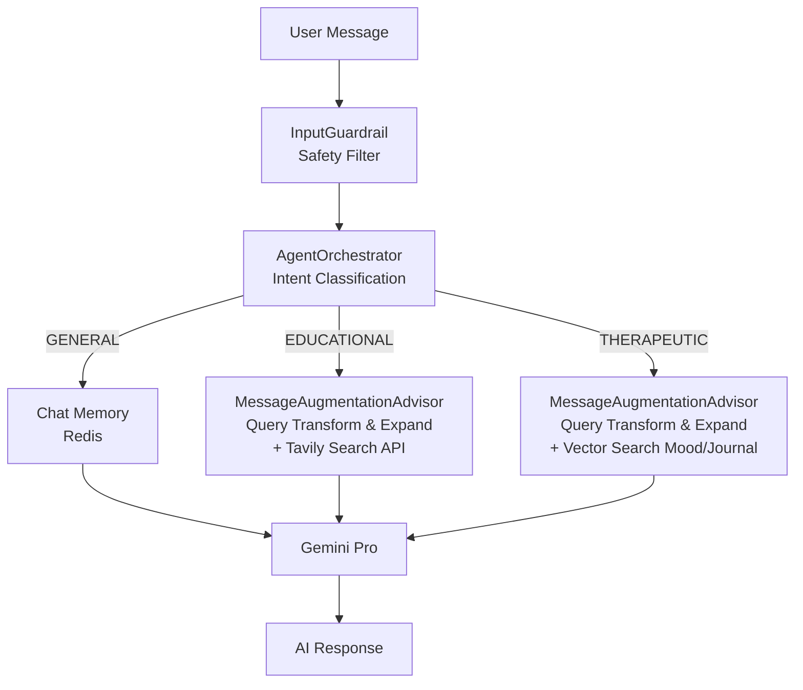

# MindBridge AI - Mental Health Platform

## Project Overview

MindBridge is a mental health platform designed to make therapeutic practices more accessible and consistent.

Currently, MindBridge serves as a bridge to an individual's own mind - helping people understand their mental state through AI chat support, mood tracking, and journaling. It's not a replacement for therapy, but reinforcement of therapeutic practices. When therapists aren't available 24/7, this platform provides support and helps maintain mental health practices between sessions.

In the future, MindBridge will also bridge connections between individuals and mental health experts, extending professional guidance beyond session hours and ensuring continuity of care.

## Project Status

This is an ongoing, long-term project with significant work ahead for production readiness. The current version represents the output of a foundational three-week development sprint, the goal of which was to rapidly build and deploy a feature-rich core platform.  
While the current implementation provides a solid foundation with modern architecture patterns, much more optimization and development is needed to meet enterprise mental health platform standards.  

## Live Demo

MindBridge is deployed and running on Google Kubernetes Engine.

**Live Application**: https://mindbridge.honne.app

**Mental Health Prediction Tool**: https://mindbridge.honne.app/prediction  
Previous academic project integrated into MindBridge - Python Flask web application that predicts mental health scores using machine learning and provides AI-powered personalized recommendations via Google's Gemini API. Features Random Forest modeling (78% accuracy) trained on 50,000 lifestyle records.  
[Repository](https://github.com/peterhonne/MentalHealthPredictor)

## Key Features

### Mental Health Tools & Analytics
- Dynamic conversation routing to therapeutic, educational, or general chat modes
- Dashboard analytics, mood tracking, journaling, and real-time AI chat
- Interactive mood logging with analytics and trend visualization
- Structured journaling with search, tagging, and mood correlation
- RAG pipeline to tailor personalized AI responses based on user's journals, moods, and mental health knowledge.
- Content filtering to ensure appropriate therapeutic interactions
- AI-generated insights and recommendations based on individual mood logs and journal entries
- Domain-specific mental health knowledge via Tavily Search API
- Secure authentication and authorization using Keycloak (OAuth 2.0)
- PostgreSQL, Redis, and vector storage for different AI use cases

## Architecture & Technology

### System Architecture


### Message Flow Architecture


### Technology Stack

I was responsible for the end-to-end backend systems, AI/RAG pipeline, cloud infrastructure, and DevOps. To accelerate the sprint, the frontend UI was developed by Claude Code.
- **Spring AI** - Prompt engineering and advanced RAG with vector database and context-aware responses
- **Spring Boot** - Microservices architecture with REST API endpoints
- **Spring Boot Actuator** - Application monitoring, health checks, and management endpoints
- **Spring Data JPA** - Data persistence and repository abstraction layer
- **PostgreSQL with pgvector** - Vector database for AI embeddings
- **Redis** - Conversation memory and caching layer
- **Google Vertex AI** - Google's advanced language and embedding model integration
- **Tavily Search API** - Mental health knowledge retrieval
- **Keycloak** - Identity and access management with OAuth2
- **Nginx** - Reverse proxy and ingress controller for Kubernetes
- **OpenAPI/Swagger** - Auto-generated API documentation and testing interface

### DevOps & Infrastructure
- **Platform**: Google Cloud Platform (GCP)
- **Orchestration**: Docker for containerization and Google Kubernetes Engine (GKE) for deployment and scaling
- **Infrastructure as Code**: Terraform for provisioning all cloud resources

## Quick Start

### Prerequisites
- Docker and Docker Compose installed
- Git for cloning the repository

### Run Locally
```bash
# Clone and navigate to project
git clone https://github.com/peterhonne/MindBridge.git
cd MindBridge

# Copy environment template and configure
cp .env.example .env
# Edit .env with your specific configuration values

# Start all services with Docker Compose
docker-compose up -d

# View logs (optional)
docker-compose logs -f
```

The application will be available at http://localhost.


## Development Timeline

### June 24 - June 28, 2025: Project Initiation Phase
Key decisions: Keycloak vs Spring Security, Spring AI vs LangChain4j.   
Made a pragmatic choice to use plain HTML/JS to accelerate UI development for the initial sprint. A full migration to React/TypeScript is planned to ensure long-term scalability and maintainability.
- Project architecture design and technology stack selection
- Maven project setup with Spring Boot microservices structure
- Basic chat functionality with customized Redis-based conversation memory
- Keycloak setup, google/github social login

### June 29 - July 5, 2025: Deployment Phase
Prioritized deployment to validate complete workflow from development to deployment.  
Got stuck at GKE Ingress network config, resolved using Nginx Ingress alternative.  
- Docker containerization for all services
- Terraform infrastructure as code setup
- Google Cloud Platform deployment with Kubernetes

### July 6 - July 13, 2025: AI Features Implementation Phase
Focused on business logic, reviewing demo repos, docs, and articles to find and implement AI patterns and techniques.  
- RAG implementation with vector database
- Mood and journal entry tracking systems
- Context-aware AI agent orchestration
- Query transformation and knowledge retrieval
- Input guardrails and safety filtering
- Tavily search API integration for mental health knowledge


## Future Work & Production Roadmap

-  **Enhanced memory management** - Redis-based multi-layer memory management system
-  **Frontend migration** - Migrate from single-file HTML to React/TypeScript for improved maintainability and scalability
-  **HIPAA-compliant encryption** - End-to-end data protection for healthcare privacy standards
-  **Prometheus monitoring** - Application metrics, health checks, and performance dashboards
-  **Automated CI/CD pipeline** - Continuous integration and deployment workflow automation
-  **Push notifications** - Real-time alerts for mood check-ins and crisis detection
-  **Kafka event streaming** - Asynchronous processing for mood analytics and external integrations
-  **HL7/FHIR healthcare data ingestion** - Healthcare interoperability standards for clinical data integration
-  **Mood pattern analytics** - Machine learning insights from user behavior

## Useful Learning Resources

### AI Memory & Learning Systems
- [Building AI Agents with Dual-Memory Architecture](https://github.com/NirDiamant/agents-towards-production/tree/main/tutorials/agent-memory-with-redis) - Redis-based tutorial for implementing episodic vs semantic memory patterns with LangGraph integration - foundational for multi-layer memory systems

### Multi-Agent Architecture
- [Multi-Agent Spring AI with Azure Cosmos DB](https://github.com/AzureCosmosDB/multi-agent-spring-ai) - Custom multi-agent orchestration framework using Spring AI with agent handoff patterns and transactional data management - influenced multi-agent design patterns

### Spring AI & RAG Implementation

**Code Examples**
- [Spring AI Examples Repository](https://github.com/spring-projects/spring-ai-examples) - Comprehensive collection of practical Spring AI patterns including agentic workflows, chat models, and prompt engineering - essential reference for enterprise AI development
- [LLM Apps with Java & Spring AI](https://github.com/ThomasVitale/llm-apps-java-spring-ai) - Production patterns for RAG, tool calling, guardrails, and observability with multiple LLM providers - comprehensive reference for Java-based AI applications

**Demo Applications**
- [Spring AI Showcase](https://github.com/piomin/spring-ai-showcase) - Multi-provider AI integration demo with OpenAI, Mistral, and Ollama showcasing function calling, RAG with Pinecone, and multimodal capabilities - practical implementation examples
- [Spring Pet Clinic AI](https://github.com/spring-petclinic/spring-petclinic-ai) - AI-enhanced version of the classic Spring Pet Clinic with natural language interaction and conversational database operations - demonstrates AI integration in traditional Spring Boot applications

**Video Tutorials**
- [Spring AI Series by Dan Vega](https://www.youtube.com/playlist?list=PLZV0a2jwt22uoDm3LNDFvN6i2cAVU_HTH) - Video tutorial series covering Spring AI fundamentals, RAG implementation, and practical examples - hands-on learning resource for Spring AI development
- [Building Intelligent Applications With Spring AI](https://www.youtube.com/watch?v=x6KmUyPWy2Q) - JetBrains live stream by Dan Vega demonstrating enterprise AI application development with Spring AI - comprehensive walkthrough of intelligent application architecture
- [Building Agents with AWS: Complete Tutorial](https://www.youtube.com/watch?v=Y291afdLroQ) - Java, Spring AI, Amazon Bedrock & MCP integration tutorial - comprehensive guide for AWS-based agent development

**Blog Posts & Articles**
- [Spring AI Agentic Patterns](https://spring.io/blog/2025/01/21/spring-ai-agentic-patterns) - Official Spring blog post covering agentic patterns and multi-agent orchestration strategies with Spring AI - foundational concepts for agent-based architectures
- [Google Cloud and Spring AI 1.0](https://cloud.google.com/blog/topics/developers-practitioners/google-cloud-and-spring-ai-10) - Google Cloud blog post covering Spring AI integration with GCP services including Vertex AI and Gemini - essential for cloud-native AI deployment
- [Spring AI Prompt Engineering Patterns](https://docs.spring.io/spring-ai/reference/api/chat/prompt-engineering-patterns.html) - Official Spring AI documentation covering prompt engineering patterns, template usage, and conversation orchestration - essential reference for optimizing AI interactions

### Infrastructure & DevOps
- [Create GKE Cluster using Terraform](https://cloud.google.com/kubernetes-engine/docs/quickstarts/create-cluster-using-terraform) - Google Cloud documentation for provisioning Kubernetes clusters with Terraform - essential for production GKE deployment setup

### Research & Academic Papers
- [ACM Digital Library Research Paper](https://dl.acm.org/doi/full/10.1145/3706598.3713359) - Academic research on AI and software engineering methodologies - theoretical foundations for AI-driven development practices

---
