# MindBridge AI - Mental Health Platform

> **AI-Powered Mental Health Platform**  
> Connecting people with accessible mental health support through modern technology.

## 🎯 Project Overview

MindBridge is a mental health platform designed to make therapeutic practices more accessible and consistent.

Currently, MindBridge serves as a bridge to an individual's own mind - helping people understand their mental state through AI chat support, mood tracking, and journaling. It's not a replacement for therapy, but reinforcement of therapeutic practices. When therapists aren't available 24/7, this platform provides support and helps maintain mental health practices between sessions.

In the future, MindBridge will also bridge connections between individuals and mental health experts, extending professional guidance beyond session hours and ensuring continuity of care.

**Why I built this:** Mental health support shouldn't be a luxury  
**What it does:** Bridges individuals to their own minds and eventually to mental health professionals  
**My goal:** Reinforce therapy, not replace it - providing support when experts aren't available

## ☁️ Production Deployment

The platform is deployed and running on Google Cloud Platform.

**Live Application**: https://mindbridge.honne.app

## ✨ Key Features

### AI-Powered Mental Health Support
- **Intelligent Intent Classification** - Dynamic conversation routing to therapeutic, educational, or general chat modes
- **Context-Aware Responses** - Leverages personal mood and journal history for personalized support
- **Retrieval Augmented Generation Pipeline** - RAG system with query transformation, domain-specific retrieval
- **Safety Guardrails** - Content filtering to ensure appropriate therapeutic interactions
- **Multi-Database Strategy** - PostgreSQL, Redis, and vector storage for different AI use cases

### Mental Health Tools & Analytics
- **Multi-View SPA** - Dashboard analytics, mood tracking, journaling, and real-time AI chat
- **Mood Tracking** - Interactive mood logging with analytics and trend visualization
- **Digital Journaling** - Structured journaling with search, tagging, and mood correlation
- **Personalized Insights** - AI-generated recommendations based on individual patterns
- **Educational Support** - Domain-specific mental health knowledge via Tavily Search API

### Enterprise Architecture
- **Identity & Access Management** - Secure authentication and authorization using Keycloak (OAuth 2.0)
- **Multi-Database Architecture** - PostgreSQL, Redis, and vector storage for different data types
- **Production Deployment** - Live on Google Cloud Platform with Kubernetes orchestration

## 🏗️ Architecture & Technology

### System Architecture

```mermaid
graph TB
    User[👤 User] --> Frontend[🌐 Frontend<br/>Progressive Web App]
    Frontend --> Auth[🔐 Keycloak<br/>Authentication Server]
    Frontend --> Gateway[🚪 API Gateway<br/>Spring Cloud Gateway]
    
    Gateway --> Orchestrator[🤖 Agent Orchestrator<br/>Spring Boot + Spring AI]
    Orchestrator --> Auth
    
    Orchestrator --> DB[(🗄️ PostgreSQL<br/>User Data & Vectors)]
    Orchestrator --> Cache[(⚡ Redis<br/>Memory & Cache)]
    Orchestrator --> Tavily[📚 Tavily Search API<br/>Knowledge Retrieval]
    Orchestrator --> LLM[🤖 Gemini Pro<br/>Language Model]
```


### Message Flow Architecture

```mermaid
graph TD
    Input[📝 User Message] --> Guard[🛡️ InputGuardrail<br/>Safety Filter]
    Guard --> Classifier[🧠 AgentOrchestrator<br/>Intent Classification]
    
    Classifier -->|GENERAL| Memory[💭 Chat Memory<br/>Redis] --> LLM[🤖 Gemini Pro]
    
    Classifier -->|EDUCATIONAL| EduAdvisor[🎓 MessageAugmentationAdvisor<br/>Query Transform & Expand<br/>+ Tavily Search API]
    
    Classifier -->|THERAPEUTIC| TherapyAdvisor[🩺 MessageAugmentationAdvisor<br/>Query Transform & Expand<br/>+ Vector Search Mood/Journal]
    
    EduAdvisor --> LLM
    TherapyAdvisor --> LLM
    
    LLM --> Response[💬 AI Response]
```


### Technology Stack

- **Progressive Web Application** - Frontend code developed by Claude Code
- **Spring AI Integration** - Advanced RAG with vector database and context-aware responses
- **Spring Boot** - Enterprise microservices framework
- **PostgreSQL with pgvector** - Vector database for AI embeddings
- **Redis** - Conversation memory and caching layer
- **Gemini Pro** - Google's advanced language model integration
- **Tavily Search API** - Mental health knowledge retrieval
- **Google Kubernetes Engine** - Production container orchestration
- **Terraform** - Infrastructure as code provisioning

### DevOps & Infrastructure
- **Platform**: Google Cloud Platform (GCP)
- **Orchestration**: Google Kubernetes Engine (GKE) with auto-scaling
- **Infrastructure as Code**: Terraform for provisioning all cloud resources

### DevOps Pipeline
```bash
terraform init → plan → apply
docker build → tag → push (Artifact Registry)  
kubectl apply → rollout restart (zero-downtime)
```

## 🚀 Quick Start

### Prerequisites
- Docker and Docker Compose installed
- Git for cloning the repository

### Run Locally
```bash
# Clone and navigate to project
git clone https://github.com/peterhonne/MindBridge.git
cd MindBridge

# Copy environment template and configure
cp .env.example .env
# Edit .env with your specific configuration values

# Start all services with Docker Compose
docker-compose up -d

# View logs (optional)
docker-compose logs -f
```

The application will be available at http://localhost.


## 📊 Development Timeline

### June 27 - June 28, 2025: Project Initiation & AI Memory Implementation
- ✅ Project architecture design and technology stack selection
- ✅ Maven project setup with Spring Boot microservices structure
- ✅ Customized Redis-based conversation memory with timestamp metadata
- ✅ Message persistence and retrieval system

### June 29 - July 5, 2025: Production Deployment Pipeline
- ✅ Docker containerization for all services
- ✅ Terraform infrastructure as code setup
- ✅ Google Cloud Platform deployment with Kubernetes
- ✅ Container registry and image management

### July 6 - July 13, 2025: Advanced AI Features
- ✅ RAG implementation with vector database
- ✅ Mood and journal entry tracking systems
- ✅ Context-aware AI agent orchestration
- ✅ Query transformation and knowledge retrieval
- ✅ Input guardrails and safety filtering
- ✅ Tavily search API integration for mental health knowledge

## 📋 Upcoming Features

- 🔄 Enhanced multi-layer memory management
- 📋 HIPAA compliance framework and medical data privacy standards
- 📋 Integration with mental health professionals platform
- 📋 Advanced analytics and personalized insights
- 📋 Mobile application development

## 📖 Useful Resources

### AI Memory & Learning Systems
- [Building AI Agents with Dual-Memory Architecture](https://github.com/NirDiamant/agents-towards-production/tree/main/tutorials/agent-memory-with-redis) - Redis-based tutorial for implementing episodic vs semantic memory patterns with LangGraph integration - foundational for multi-layer memory systems

### Multi-Agent Architecture
- [Multi-Agent Spring AI with Azure Cosmos DB](https://github.com/AzureCosmosDB/multi-agent-spring-ai) - Custom multi-agent orchestration framework using Spring AI with agent handoff patterns and transactional data management - influenced multi-agent design patterns

### Spring AI & RAG Implementation

**Code Examples**
- [Spring AI Examples Repository](https://github.com/spring-projects/spring-ai-examples) - Comprehensive collection of practical Spring AI patterns including agentic workflows, chat models, and prompt engineering - essential reference for enterprise AI development
- [LLM Apps with Java & Spring AI](https://github.com/ThomasVitale/llm-apps-java-spring-ai) - Production patterns for RAG, tool calling, guardrails, and observability with multiple LLM providers - comprehensive reference for Java-based AI applications

**Demo Applications**
- [Spring AI Showcase](https://github.com/piomin/spring-ai-showcase) - Multi-provider AI integration demo with OpenAI, Mistral, and Ollama showcasing function calling, RAG with Pinecone, and multimodal capabilities - practical implementation examples
- [Spring Pet Clinic AI](https://github.com/spring-petclinic/spring-petclinic-ai) - AI-enhanced version of the classic Spring Pet Clinic with natural language interaction and conversational database operations - demonstrates AI integration in traditional Spring Boot applications

**Video Tutorials**
- [Spring AI Series by Dan Vega](https://www.youtube.com/playlist?list=PLZV0a2jwt22uoDm3LNDFvN6i2cAVU_HTH) - Video tutorial series covering Spring AI fundamentals, RAG implementation, and practical examples - hands-on learning resource for Spring AI development
- [Building Intelligent Applications With Spring AI](https://www.youtube.com/watch?v=x6KmUyPWy2Q) - JetBrains live stream by Dan Vega demonstrating enterprise AI application development with Spring AI - comprehensive walkthrough of intelligent application architecture
- [Building Agents with AWS: Complete Tutorial](https://www.youtube.com/watch?v=Y291afdLroQ) - Java, Spring AI, Amazon Bedrock & MCP integration tutorial - comprehensive guide for AWS-based agent development

**Blog Posts & Articles**
- [Spring AI Agentic Patterns](https://spring.io/blog/2025/01/21/spring-ai-agentic-patterns) - Official Spring blog post covering agentic patterns and multi-agent orchestration strategies with Spring AI - foundational concepts for agent-based architectures
- [Google Cloud and Spring AI 1.0](https://cloud.google.com/blog/topics/developers-practitioners/google-cloud-and-spring-ai-10) - Google Cloud blog post covering Spring AI integration with GCP services including Vertex AI and Gemini - essential for cloud-native AI deployment

### Infrastructure & DevOps
- [Create GKE Cluster using Terraform](https://cloud.google.com/kubernetes-engine/docs/quickstarts/create-cluster-using-terraform) - Google Cloud documentation for provisioning Kubernetes clusters with Terraform - essential for production GKE deployment setup

### Research & Academic Papers
- [ACM Digital Library Research Paper](https://dl.acm.org/doi/full/10.1145/3706598.3713359) - Academic research on AI and software engineering methodologies - theoretical foundations for AI-driven development practices

---
